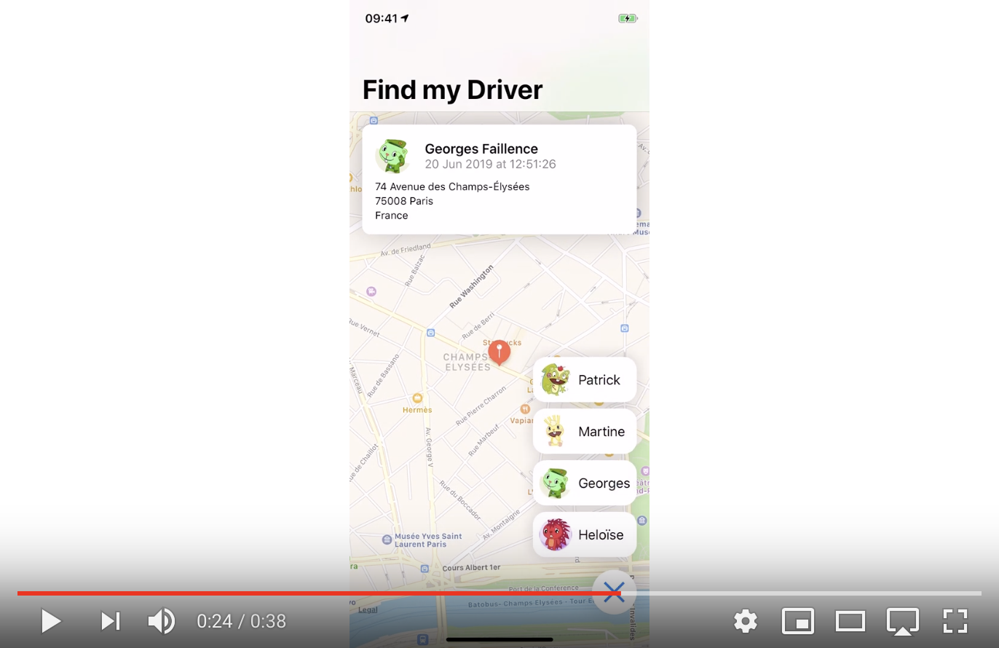

# Technical Test Instructions

John Appleseed, a Heetch employee was working on a brand new application allowing our local teams to find and follow in (almost) realtime a driver's location.
Unfortunately for this project, John had to deal with an urgent situation which lefts you responsible for terminating what he started.


## Find My Driver

**Find My Driver** is a simple application showing a map automatically recentered on the latest known location of a given driver. To follow a driver, the user has to tap on the bottom-right "menu" button and select one of the 4 drivers around.
Once selected, the app shows the map centered on the driver's location and displays a banner with the driver's fullname, it's profile picture and the current postal address of its location.
​
Unfortunately, there's not much specs. In addition to what you'll be able to infer from the mockup video below and from the code John Appleseed already wrote, here are a few more rules:
- Once a driver is followed, its location must be refreshed every 5s and the map should automatically recenter itself on the new location ⏳
- The app must be localized in French and English 🇫🇷 🇺🇸
- Errors and edge cases must be gracefully handled 👌
- The app must work on iOS 12 minimum, only on iPhone in portrait mode 📲
- Feel free to add anything you want in this app to make it more awesome 😉

[](https://youtu.be/3-5izngy3l0)

## Drivers Coordinate
The list of drivers around a location is fetchable using a REST API:

**URL**
```
PUT http://hiring.heetch.com/mobile/coordinates
```

**Headers**
```
Accept: application/json
Content-Type: application/json
```

**Body**
```json
{
    "latitude": 48.858181,
    "longitude": 2.348090
}
```

**Response**
```json
[
    {
        "id": 1,
        "firstname": "Patrick",
        "lastname": "Delapique",
        "image": "/mobile/images/nutty.jpg",
        "coordinates": {
            "latitude": 48.86162,
            "longitude": 2.34490
        }
    }
]
```

## Technical Test Tasks

- [ ] Checkout the project 📥
- [ ] Create a new branch for the implementation 🎋
- [ ] Implement the app to match specs and video above 🚧
- [ ] Open a Pull Request on this repository to submit your work 📤


## Test Evaluation

In complete transparency, here are the main points we will evaluate, plus some advice 😉
- The result must match as much as possible what you can see on the video. An incomplete app won't be reviewed.
- The app must be great from a user point of view. Don't forget edge cases and unhappy paths!
- We will evaluate your overall knowledge of RxSwift and your understanding of Functional Reactive Programming.
- We will evaluate your overall knowledge of system frameworks and APIs.
- We will make sure you know how to test your code but please don't aim for a 100% test coverage.
- We will pay attention to how clean, concise and well-organized is your code. Please be careful to avoid over-engineering just to show us what you're capable of.


## Additional Information

- 📄 Some files have already been created by John Appleseed and left available. Feel free to use, modify, fix, refactor or remove anything you want.
- 📦 No other 3rd party libraries than the ones already defined in the Podfile are allowed (but you don't have to use them all if you don't need to).
- 🏗 You're free to pick the architecture and patterns you want to, as soon they're relevant we're open to everything.
- ⏱ Though we give ~5 days to complete this test, it should be doable in few hours, keep it cool!
- ❓If you have any questions, feel free to open an issue on this repository and we'll try to answer you as quickly as possible.
- 😊 We really hope you'll enjoy doing this technical test.
